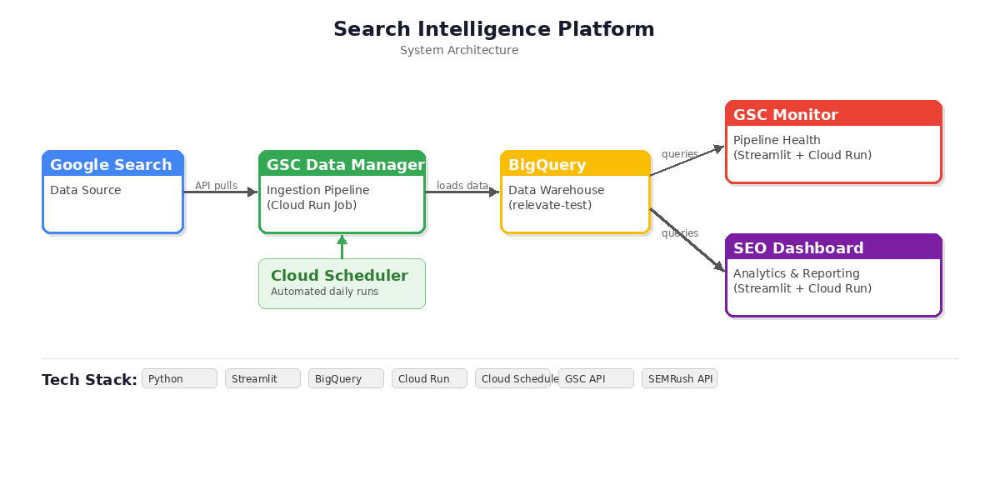
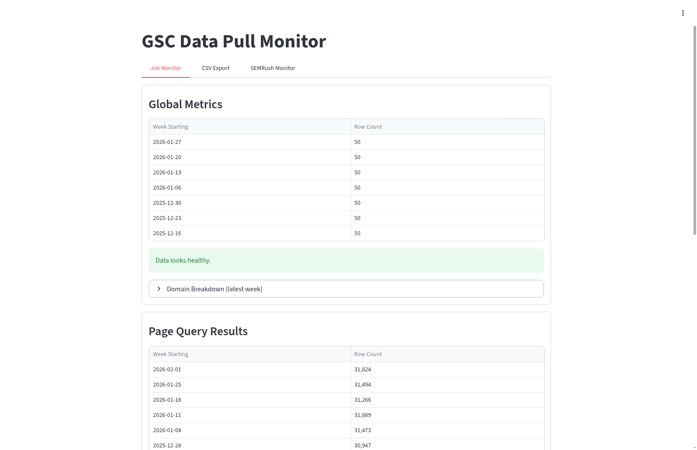
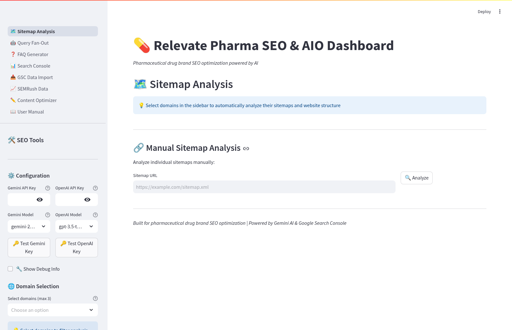
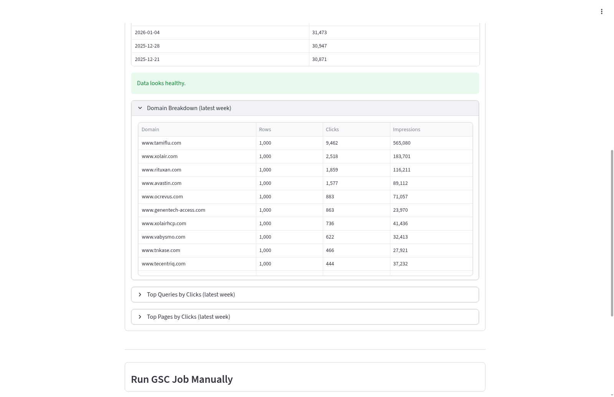

# Search Intelligence Platform (GSC Ingestion + Monitoring + Dashboard)

A cloud-ready platform that ingests Google Search Console data into BigQuery, monitors pipeline health, and provides an analytics dashboard for SEO reporting and troubleshooting.

## What this is
This project packages three existing components into one end-to-end system:

1. **GSC Data Manager** — data ingestion pipeline (GSC API → BigQuery)
2. **GSC Monitor** — monitoring for job runs, failures, and freshness
3. **SEO Dashboard** — reporting and analytics UI on top of the warehouse

## System architecture

High-level flow:

Google Search Console API  
→ Ingestion jobs (Cloud Run job / local runner)  
→ BigQuery warehouse  
→ Monitoring UI (job/run health)  
→ SEO Dashboard (analytics + reporting)

## Modules (repositories)

- **Module 1: GSC Data Manager**
  - Repo: <PASTE_REPO_URL>
  - Purpose: Pulls GSC data and loads it to BigQuery (scheduled + backfill patterns)

- **Module 2: GSC Monitor**
  - Repo: <PASTE_REPO_URL>
  - Purpose: Observability for ingestion runs (success/fail, latency, freshness)

- **Module 3: SEO Dashboard**
  - Repo: <PASTE_REPO_URL>
  - Purpose: Streamlit analytics dashboard powered by BigQuery

## Key capabilities
- Scheduled ingestion of GSC data into a queryable warehouse
- Monitoring + pipeline health checks (job success, failure, staleness)
- Dashboard for SEO performance analytics and operational troubleshooting

## Tech stack
- Python
- Google Search Console API
- BigQuery
- Cloud Run Jobs / Cloud Scheduler (for production scheduling)
- Streamlit (UIs)

## Screenshots
- Monitoring UI: 
- Dashboard UI: 
- Example BigQuery tables: 

## How to run (high level)
See:
- docs/runbook.md
- docs/modules.md

## Notes
This is a packaging repo intended to present the system end-to-end. The implementation lives in the module repos above.
